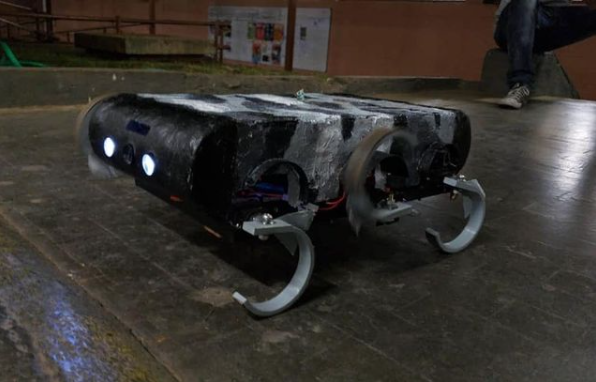

# Trabalho de Conclusão de Curso - Técnico em Mecatrônica - 1° Semestre, 2019. _(Este repositório foi reorganizado em 2021)_
ETEC Martin Luther King - Orientador: Professor Mestre Engenheiro Paulo Roberto Murguer Nogueira

[Badge]("ETEC")[Badge]("Mecatrônica")[Badge]("Hexápode")
> Status do Projeto: Concluido :heavy_check_mark:


```C++ 
Serial.print("ESTOU VIVO!");
``` 
:laughing:
## Grupo
[ <br> <sub> Allan Del Valle </sub>](https://www.linkedin.com/in/allan-del-valle-1b8012140/) |
| :---: |  [ <br> <sub> Daniel Lopes Soares </sub>](https://github.com/DanielCreeklear) |
| :---: |  

* _ENRIQUE EMANUEL REZENDE TAVARES DA SILVA_ - @Oiapokxui
* _GABRIEL LUÍS FRUTUOSO_
## Resumo
  Inspirado em um dos [robôs](https://www.youtube.com/watch?v=ISznqY3kESI) criados pela Boston Dynamics, o projeto se resume a um robô hexápode cujo propósito é ser remotamente controlado, útil em ambientes que inviabilizam o uso das rodas. Surge da necessidade de um robô que percorresse a maioria dos terrenos sem muitas dificuldades. Para isso, constitui-se de seis patas com o formato ‘C’, que garante uma boa mobilidade. Com controle por rádio frequência, também inclui uma câmera sem fio, que permite monitoramento a distância e auxilia o controle dos movimentos executados pelo  robô. O  projeto  foi  construído  inteiramente  por  observações  de material  audiovisual.
## Equipamentos do robô :checkered_flag:

:trophy: Câmera FPV por radio frequência 

:trophy: Controle com 4 botões e 1 analógico via Rádio Frequência

:trophy: Sensor Ultrassônico para navegação autônoma


